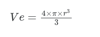

# Aritimética de Ponto Flutante

## Questão 1

Escreva um programa que receba um valor decimal referente ao raio de uma esfera, calcule e imprima o seu volume (Ve).

O cálculo do volume deverá ser obrigatoriamente realizado em uma função.

Dicas: para carregar o número $\pi$ para a FPU, utilize a instrução FLDPI.

Equações:

* **Entrada:**

    O programa recebe o raio de uma esfera.

* **Saída:**

    A saı́da consiste do volume da esfera.

* **Exemplo de Entrada:**

    5

* **Exemplo de Saída:**

    523,60

---
