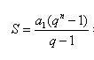

# Aritmética Inteira

## Questão 1

Sabendo que uma PG tem $a_{1}$ e razão q, determine a soma dos 10 primeiros termos dessa progressão.

O cálculo é dado pela equação abaixo:

* **Entrada:**

    O programa recebe $a_{1}$ e q

* **Saída:**

    A saı́da consiste de imprimir a soma dos 10 primeiros termos da PG.

* **Exemplo de Entrada:**

    4 2

* **Exemplo de Saída:**

    4092

---

## Questão 2

Escreva um algoritmo que recebe um número **n** e uma base **b**.

Seu algoritmo deve imprimir o logaritmo de **n** na base **b**.

* **Entrada:**

    O programa recebe **n** e **b**

* **Saída:**

    A saı́da consiste de imprimir o logaritmo de **n** na base **b**.

* **Exemplo de Entrada:**

    4096 2

* **Exemplo de Saída:**

    12
